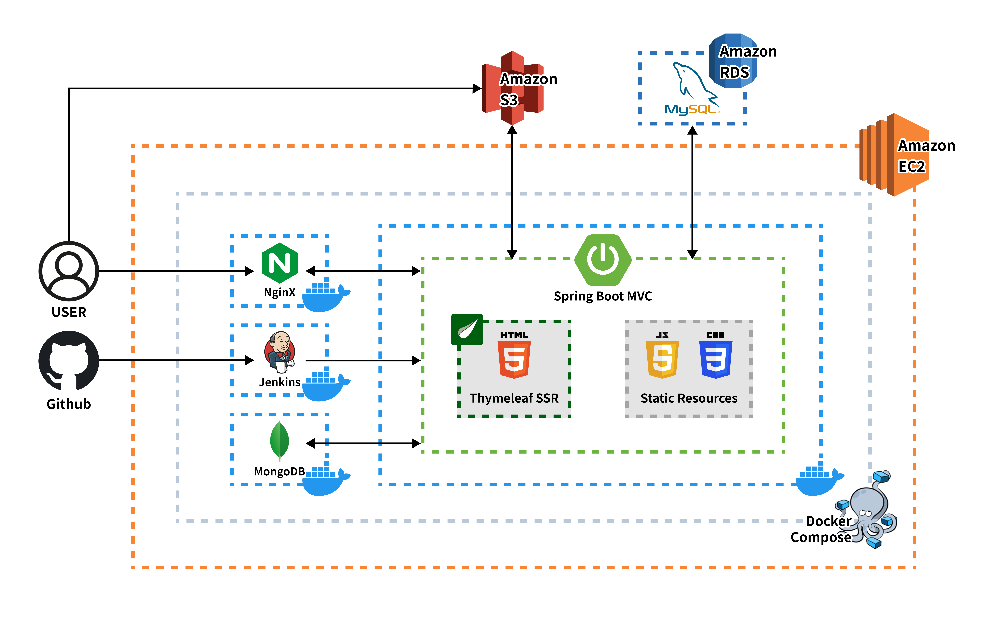
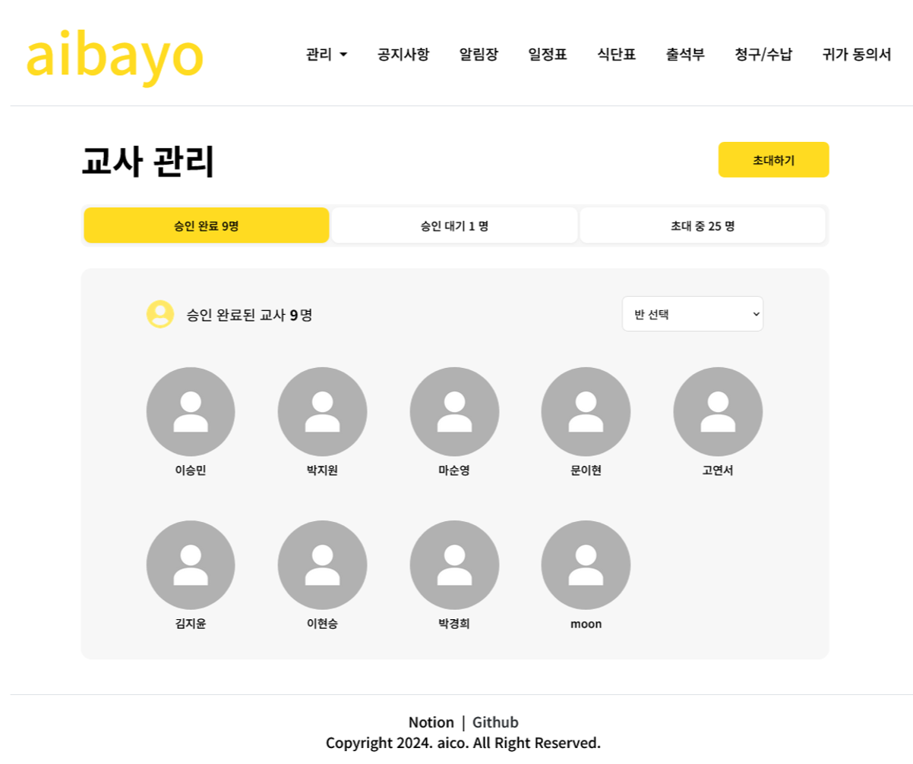
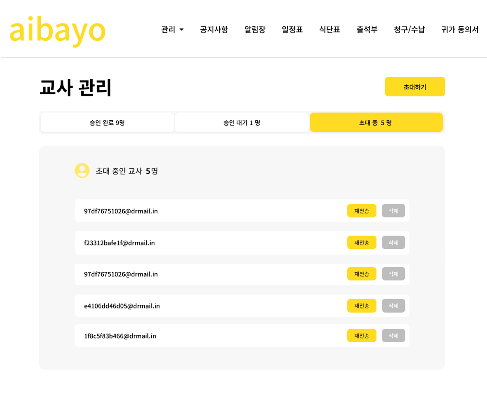
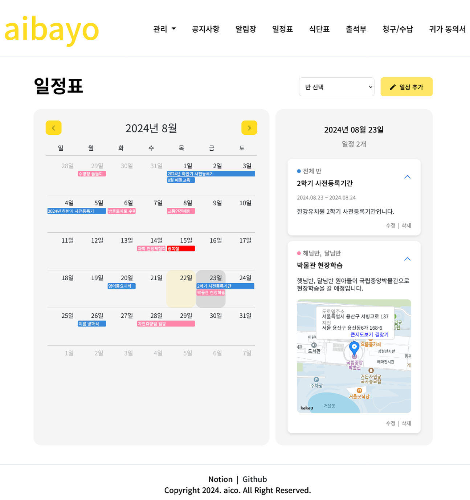
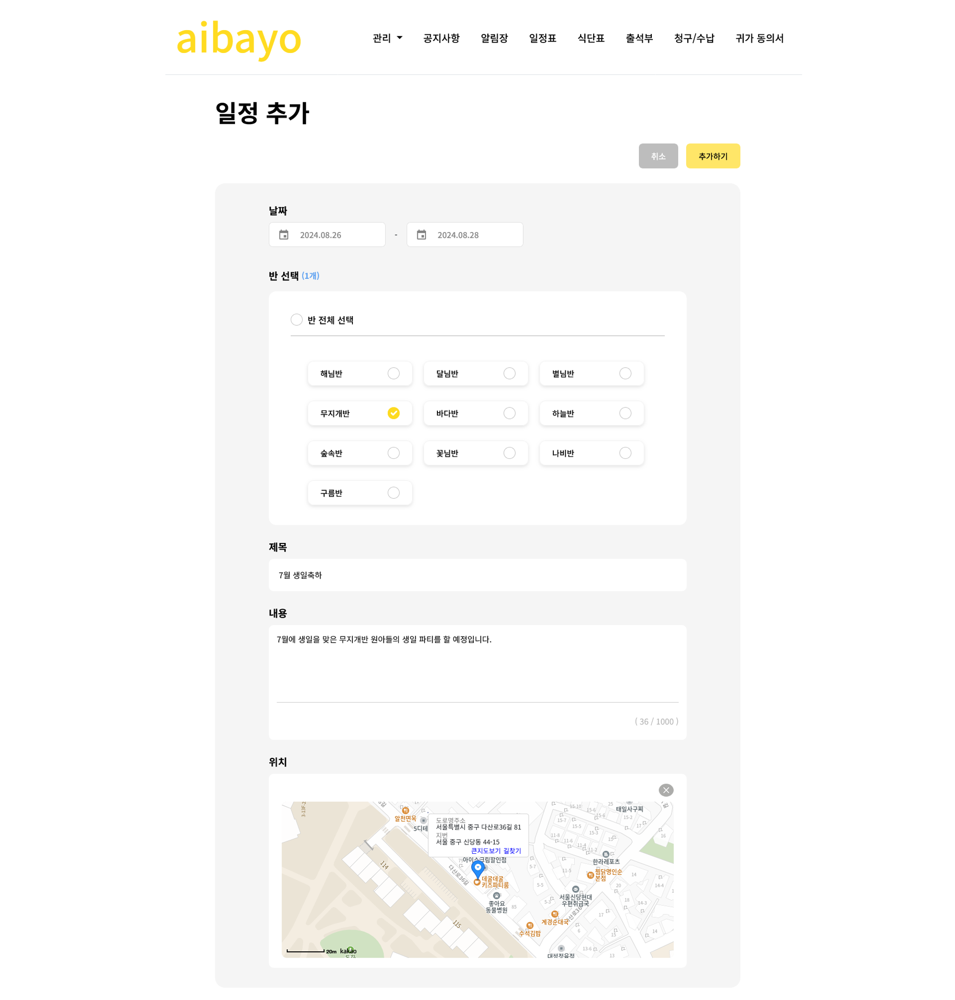
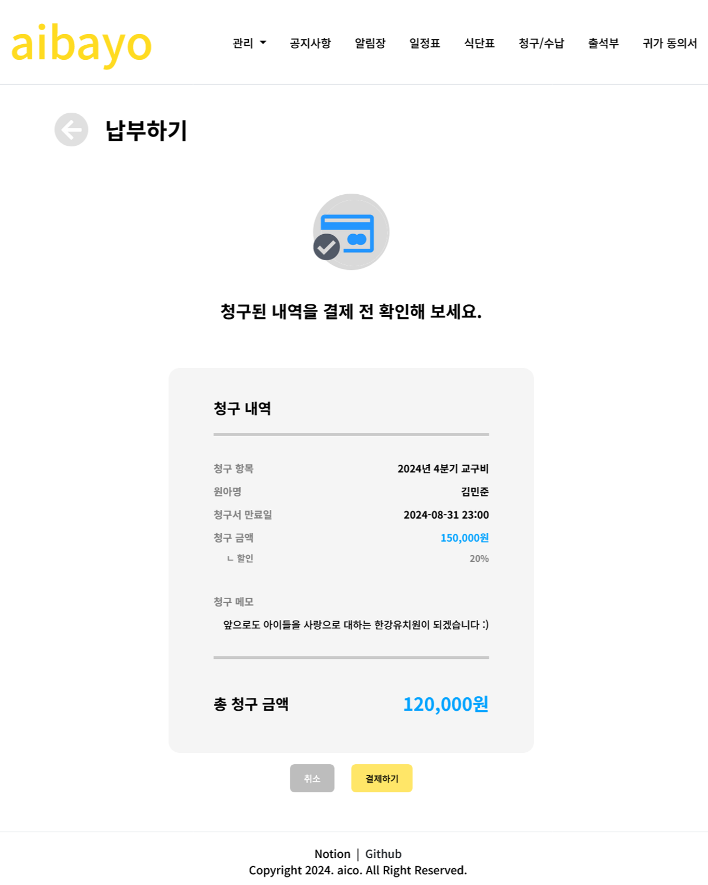

  

---

<h3 align="center" style="margin: 0;">
 원장, 교사, 학부모 모두가 원하는 유치원 B2B 서비스
</h3>

 유치원을 효율적으로 관리하기 위한 ERP 시스템을 제공하며, 
학부모 입장에서도 원생 정보를 쉽게 열람하고 유치원과 소통할 수 있도록 지원합니다.
  

📅 <b>2024.07.05 ~ 2024.08.23</b> | 👥 <b>Full-Stack 4인</b>

##  🛠 기술 스택

### Backend

### Frontend

### DevOps & Infra

##  🏗 System Architecture

##  📊 ERD

##  💡 기술적 경험

### DB 접근 방식에서 SQL Mapper와 ORM을 모두 경험

- **Semi 단계**: **MyBatis**를 사용해 SQL문을 작성하여 개발
- **Final 단계**: **Spring Framework**를 적용하며 **JPA**와 **QueryDSL**을 사용해 보다 객체 중심적으로 재설계 및 기능 확장

### 다양한 Open API 사용

- 외부 API를 연동하여 필요한 곳에 효율적으로 추가 기능 구현

##  🎯 담당 개발 기능

### 1. 교사 조회 및 승인 상태 변경 기능

해당 유치원에 소속된 교사의 승인 상태에 대한 **CRUD** 기능을 구현

<table>
  <tr>
    <td width="50%">
      
    </td>
    <td width="50%">
      
    </td>
  </tr>
</table>

- **Backend**: Spring Data JPA와 QueryDSL을 활용하여 동적 쿼리 구성 및 승인 상태별 조회 기능 구현
- **Frontend**: Thymeleaf와 AJAX를 사용해 비동기적으로 승인 상태 변경 및 실시간 UI 업데이트
- **Transaction 관리**: 교사 수정 또는 삭제 시 다른 관계(반 배정, 권한 등)와의 수정 작업을 Transaction하게 처리
- **메일 전송 기능**: Google SMTP를 사용하여 메일 전송을 통한 초대 기능 구현

###  2. 외부 캘린더 API 연동을 통한 일정표 CRUD 기능

**Fullcalendar API**를 사용하여 캘린더 표시 및 **Google Calendar API** 연동으로 공휴일 자동 설정

<table>
  <tr>
    <td width="50%">
      
    </td>
    <td width="50%">
      
    </td>
  </tr>
</table>

- **Backend**: Spring Boot REST API로 일정 데이터를 JSON 형식으로 제공하며, JPA를 통한 데이터 영속성 관리
- **Frontend**: Fullcalendar 라이브러리를 활용한 인터랙티브한 UI 구성
- **AJAX 비동기 처리**: 날짜별, 반별 일정 상세 조회는 AJAX를 통해 비동기 처리하여 페이지 전환 없이 빠른 조회 가능
- **지도 API 연동**: **Kakao Map API**를 사용하여 일정에 위치 정보를 추가할 수 있는 기능 구현

###  3. 외부 결제 API 연동을 통한 결제 기능

**Datatables API**를 사용해 청구 및 수납 내역 목록 조회 및 페이징 처리

<table>
  <tr>
    <td width="50%">
      
    </td>
    <td width="50%">
      
    </td>
  </tr>
</table>

- **Backend**: Spring Data JPA와 QueryDSL을 통한 동적 검색 쿼리 구현 및 결제 정보 관리
- **Frontend**: Datatables를 활용한 정렬, 페이징, 검색 기능이 통합된 데이터 테이블 구성
- **검색 기능**: 기간 선택, 수납 상태, 반, 검색어 등을 통한 다중 조건 검색 기능 구현
- **결제 연동**: **TossPay API**를 사용하여 user 페이지에서 안전한 온라인 결제 가능

